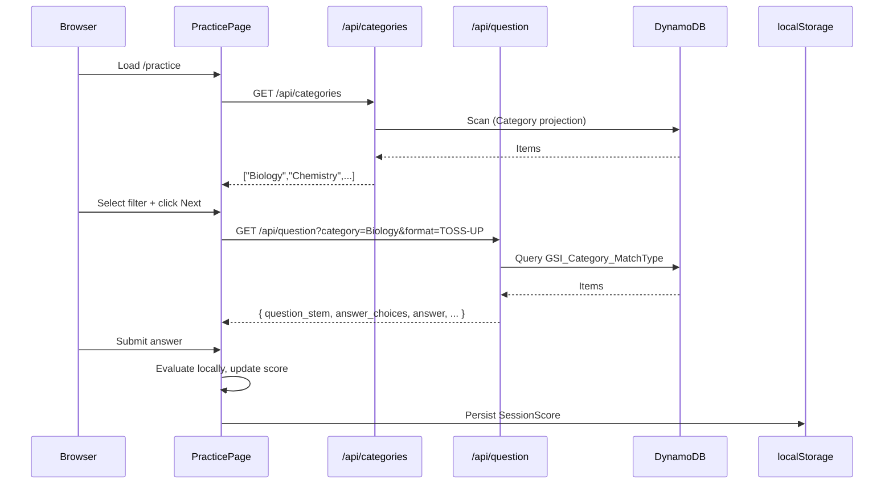

# Design Document — BowlPrep Frontend

## Overview

BowlPrep is a Next.js 14 (App Router) web application that lets students practice Science Bowl questions. The app reads questions from the pre-existing `ScienceBowlQuestions` DynamoDB table and presents them in an interactive practice interface. Students filter by category and answer format, receive immediate feedback, and track a session score.

All DynamoDB access is strictly server-side via Next.js API routes using AWS SDK v3. The browser never touches AWS credentials or the SDK.

**Key design decisions:**

- **App Router only** — no Pages Router. Layouts, loading states, and error boundaries use the App Router file conventions.
- **Server Components for data-free shells, Client Components for interactivity** — the practice page is a Client Component because it manages local state (current question, score, filter selections).
- **API routes as a thin data layer** — `/api/categories` and `/api/question` are the only places that touch DynamoDB. They are pure request/response handlers with no shared state.
- **localStorage for session persistence** — score survives page refresh without a backend session store.
- **Tailwind CSS with custom design tokens** — colors and font are configured in `tailwind.config.ts`.

---

## Architecture

```
Browser
  └── Next.js App Router (web/)
        ├── app/
        │   ├── layout.tsx          ← Root layout: Inter font, surface bg, Nav
        │   ├── page.tsx            ← Redirects to /practice
        │   └── practice/
        │       └── page.tsx        ← Client Component: full practice UI
        ├── components/
        │   ├── Nav.tsx             ← Responsive nav (bottom mobile / top desktop)
        │   ├── FilterBar.tsx       ← Category + format selectors
        │   ├── QuestionWorkspace.tsx ← Question display + answer input
        │   ├── AnswerFeedback.tsx  ← Correct/incorrect overlay
        │   └── ScoreDisplay.tsx    ← "7 / 10" score badge
        ├── lib/
        │   ├── dynamo.ts           ← DynamoDB client factory (server-only)
        │   ├── score.ts            ← SessionScore read/write to localStorage
        │   └── types.ts            ← Shared TypeScript types
        └── app/api/
            ├── categories/route.ts ← GET /api/categories
            └── question/route.ts   ← GET /api/question
```



---

## Components and Interfaces

### API Routes

#### `GET /api/categories`

Returns a deduplicated, sorted array of category strings.

```typescript
// Response: 200
type CategoriesResponse = string[];

// Response: 500
type ErrorResponse = { message: string };
```

**Implementation sketch:**
1. Create a DynamoDB client via `lib/dynamo.ts`.
2. Run a `ScanCommand` with `ProjectionExpression: "Category"`.
3. Collect all `Category` values, deduplicate with a `Set`, sort alphabetically.
4. Return `NextResponse.json(categories)`.
5. On error, return `NextResponse.json({ message }, { status: 500 })`.

#### `GET /api/question?category=&format=`

Returns one randomly selected question matching the filters.

```typescript
// Query params
interface QuestionParams {
  category?: string; // omit or "All Categories" → no category filter
  format?: "All" | "Multiple Choice" | "Short Answer" | "TOSS-UP" | "BONUS";
}

// Response: 200
interface QuestionResponse {
  Set_Round: string;
  Question_Id: string;
  Category: string;
  MatchType: "TOSS-UP" | "BONUS";
  question_stem: string;
  answer_choices: string[];
  answer: string;
  answer_format: "Multiple Choice" | "Short Answer";
}

// Response: 404 | 500
type ErrorResponse = { message: string };
```

**Query strategy:**

| category | format | DynamoDB operation |
|---|---|---|
| "All Categories" / omitted | any | `ScanCommand` with optional filter |
| specific category | "All" / omitted | `QueryCommand` on `GSI_Category_MatchType`, KeyCondition: `Category = :cat` |
| specific category | "TOSS-UP" / "BONUS" | `QueryCommand` on GSI, KeyCondition: `Category = :cat AND MatchType = :mt` |
| specific category | "Multiple Choice" / "Short Answer" | `QueryCommand` on GSI, KeyCondition: `Category = :cat`, FilterExpression: `answer_format = :af` |
| "All Categories" | "TOSS-UP" / "BONUS" | `ScanCommand`, FilterExpression: `MatchType = :mt` |
| "All Categories" | "Multiple Choice" / "Short Answer" | `ScanCommand`, FilterExpression: `answer_format = :af` |

After fetching, pick one item at random: `items[Math.floor(Math.random() * items.length)]`.

### Client Components

#### `FilterBar`

```typescript
interface FilterBarProps {
  categories: string[];
  selectedCategory: string;
  selectedFormat: AnswerFormatFilter;
  onCategoryChange: (category: string) => void;
  onFormatChange: (format: AnswerFormatFilter) => void;
  isLoading: boolean;
}

type AnswerFormatFilter = "All" | "Multiple Choice" | "Short Answer" | "TOSS-UP" | "BONUS";
```

#### `QuestionWorkspace`

```typescript
interface QuestionWorkspaceProps {
  question: QuestionResponse;
  onAnswerSubmit: (isCorrect: boolean) => void;
  isAnswered: boolean;
}
```

Renders either MC cards (W/X/Y/Z) or a text input + Submit button based on `question.answer_format`. Never renders both simultaneously.

#### `AnswerFeedback`

```typescript
interface AnswerFeedbackProps {
  isCorrect: boolean;
  correctAnswer: string;
  onNext: () => void;
}
```

#### `ScoreDisplay`

```typescript
interface ScoreDisplayProps {
  correct: number;
  total: number;
}
```

#### `Nav`

Renders a bottom bar on mobile (`< 768px`) and a sticky top bar on desktop (`≥ 768px`). Uses Tailwind responsive prefixes (`md:`).

---

## Data Models

### DynamoDB Item Shape

```typescript
/** Mirrors the DynamoDB record written by the ETL pipeline. */
interface DynamoQuestion {
  Set_Round: string;       // Partition key
  Question_Id: string;     // Sort key
  Category: string;        // GSI partition key (GSI_Category_MatchType)
  MatchType: "TOSS-UP" | "BONUS"; // GSI sort key
  question_stem: string;
  answer_choices: string[]; // Empty array for Short Answer
  answer: string;
  answer_format: "Multiple Choice" | "Short Answer";
  source_s3_key: string;   // Not returned to the client
}
```

### Session Score

```typescript
interface SessionScore {
  correct: number;
  total: number;
}

const SESSION_SCORE_KEY = "bowlprep_session_score";
```

Stored in `localStorage` as JSON. Read on mount; written after every answer submission.

### Practice Filter

```typescript
interface PracticeFilter {
  category: string;        // "All Categories" or a specific category name
  format: AnswerFormatFilter;
}
```

---

## Correctness Properties

*A property is a characteristic or behavior that should hold true across all valid executions of a system — essentially, a formal statement about what the system should do. Properties serve as the bridge between human-readable specifications and machine-verifiable correctness guarantees.*

### Property 1: Category selector completeness

*For any* non-empty array of category strings returned by the API, the rendered category selector SHALL contain an option for every string in that array plus exactly one "All Categories" option.

**Validates: Requirements 1.1**

---

### Property 2: Filter parameters propagate to fetch URL

*For any* valid (category, format) combination selected in the FilterBar, the URL used to fetch the next question SHALL contain `category` and `format` query parameters that exactly match the selected values.

**Validates: Requirements 1.3**

---

### Property 3: Random question selection is always a member of the result set

*For any* non-empty array of DynamoDB items returned by a query, the item selected by the random-selection function SHALL always be an element of that array.

**Validates: Requirements 2.1, 8.5**

---

### Property 4: QuestionWorkspace renders all question data

*For any* question object (both Multiple Choice and Short Answer), the rendered QuestionWorkspace SHALL display the `question_stem`, `Category`, and `MatchType`, and SHALL render exactly one answer input type — MC cards for `Multiple Choice`, text input for `Short Answer` — never both simultaneously.

**Validates: Requirements 3.1, 3.2, 3.3**

---

### Property 5: Answer state is cleared on new question load

*For any* sequence of two distinct questions, after the second question is loaded into the QuestionWorkspace, all answer input state from the first question SHALL be absent.

**Validates: Requirements 3.5**

---

### Property 6: Short answer comparison is case- and whitespace-insensitive

*For any* short answer string with arbitrary leading/trailing whitespace and mixed casing, the correctness evaluation SHALL produce the same result as comparing `input.trim().toLowerCase()` against `storedAnswer.trim().toLowerCase()`.

**Validates: Requirements 4.2**

---

### Property 7: Multiple choice evaluation is immediate

*For any* multiple choice question and any selected answer option, the AnswerFeedback SHALL be shown immediately upon selection without requiring a separate submit action.

**Validates: Requirements 4.1**

---

### Property 8: Skip leaves SessionScore unchanged

*For any* SessionScore state, clicking Skip SHALL leave both the `correct` count and the `total` count identical to their values before the skip.

**Validates: Requirements 4.6, 5.4**

---

### Property 9: Correct answer increments both counts

*For any* SessionScore state, submitting a correct answer SHALL increment `correct` by exactly 1 and `total` by exactly 1.

**Validates: Requirements 5.2**

---

### Property 10: Incorrect answer increments only total

*For any* SessionScore state, submitting an incorrect answer SHALL leave `correct` unchanged and increment `total` by exactly 1.

**Validates: Requirements 5.3**

---

### Property 11: SessionScore localStorage round-trip

*For any* SessionScore value, writing it to localStorage and reading it back SHALL produce a value with identical `correct` and `total` fields.

**Validates: Requirements 5.5**

---

### Property 12: Score display reflects current state

*For any* SessionScore with values `correct` and `total`, the rendered ScoreDisplay SHALL contain the text `"{correct} / {total}"`.

**Validates: Requirements 5.6**

---

### Property 13: Categories API returns distinct values

*For any* DynamoDB scan result containing duplicate Category values, the `/api/categories` response SHALL contain each category string exactly once (no duplicates).

**Validates: Requirements 7.1**

---

### Property 14: Question API response contains all required fields

*For any* question record in DynamoDB, the `/api/question` response SHALL include all eight required fields: `Set_Round`, `Question_Id`, `Category`, `MatchType`, `question_stem`, `answer_choices`, `answer`, and `answer_format`.

**Validates: Requirements 8.6**

---

## Error Handling

| Scenario | Behavior |
|---|---|
| `GET /api/categories` fails | Show error message + retry button in FilterBar; retry re-issues the request |
| `GET /api/question` returns 404 | Show "No questions found for this filter" message with a prompt to change filters |
| `GET /api/question` returns 500 | Show error message + retry button in QuestionWorkspace |
| No questions match filter | API returns 404; UI shows descriptive message |
| localStorage unavailable | Score operations are no-ops; score displays as "0 / 0" |
| AnswerFeedback render failure | Fall back to plain-text success/error indicator (per requirements 4.3, 4.4) |
| Skip during in-flight submission | In-flight fetch is aborted via `AbortController`; skip is processed immediately |

All API route errors are caught in a `try/catch` block. Errors are logged server-side; only a safe `message` string is returned to the client — never a stack trace.

---

## Testing Strategy

### Unit Tests (Jest + React Testing Library)

Located in `web/__tests__/`. Mock all external dependencies (DynamoDB client, `fetch`, `localStorage`).

**Component tests:**
- `FilterBar`: category options rendered, format options rendered, onChange callbacks fire
- `QuestionWorkspace`: MC cards rendered for MC questions, text input for SA questions, state cleared on new question
- `AnswerFeedback`: success/error colors applied, correct answer shown on incorrect, Next button present
- `ScoreDisplay`: displays correct format string
- `Nav`: bottom bar at mobile viewport, top bar at desktop viewport

**API route tests (using `next-test-api-route-handler` or direct handler invocation):**
- `/api/categories`: deduplication, 500 on DynamoDB error
- `/api/question`: all filter branch combinations, 404 on empty result, 500 on DynamoDB error

**Utility tests:**
- `lib/score.ts`: read/write/initialize from localStorage mock
- Answer comparison normalization

### Property-Based Tests (fast-check)

Located in `web/__tests__/properties/`. Each test runs a minimum of 100 iterations.

Property tests use `fast-check` (TypeScript-native, no extra setup). Mock DynamoDB and localStorage.

```
// Tag format: Feature: bowlprep-frontend, Property {N}: {property_text}
```

| Property | Test file | Arbitraries used |
|---|---|---|
| P1: Category selector completeness | `filterBar.property.test.ts` | `fc.array(fc.string())` |
| P2: Filter params propagate to fetch URL | `practicePage.property.test.ts` | `fc.record({ category: fc.string(), format: fc.constantFrom(...) })` |
| P3: Random selection is a member | `questionApi.property.test.ts` | `fc.array(fc.record({...}), { minLength: 1 })` |
| P4: QuestionWorkspace renders all data | `questionWorkspace.property.test.ts` | `fc.record({ question_stem: fc.string(), Category: fc.string(), ... })` |
| P5: Answer state cleared on new question | `questionWorkspace.property.test.ts` | `fc.tuple(questionArb, questionArb)` |
| P6: SA comparison is case/whitespace insensitive | `answerEval.property.test.ts` | `fc.string()` with whitespace/case mutations |
| P7: MC evaluation is immediate | `questionWorkspace.property.test.ts` | `fc.record({ answer_choices: fc.array(fc.string(), {minLength:4, maxLength:4}), ... })` |
| P8: Skip leaves score unchanged | `score.property.test.ts` | `fc.record({ correct: fc.nat(), total: fc.nat() })` |
| P9: Correct answer increments both counts | `score.property.test.ts` | `fc.record({ correct: fc.nat(), total: fc.nat() })` |
| P10: Incorrect answer increments only total | `score.property.test.ts` | `fc.record({ correct: fc.nat(), total: fc.nat() })` |
| P11: Score localStorage round-trip | `score.property.test.ts` | `fc.record({ correct: fc.nat(), total: fc.nat() })` |
| P12: Score display reflects state | `scoreDisplay.property.test.ts` | `fc.record({ correct: fc.nat(), total: fc.nat() })` |
| P13: Categories API returns distinct values | `categoriesApi.property.test.ts` | `fc.array(fc.constantFrom(...categories))` with duplicates |
| P14: Question API response has all required fields | `questionApi.property.test.ts` | `fc.record({ Set_Round: fc.string(), ... })` |

### Integration Tests

- End-to-end smoke test against a real DynamoDB table (using `onasmmon` profile) to verify the GSI query works and returns valid data shapes.
- Run manually or in CI with `AWS_PROFILE=onasmmon`.

### Test Configuration

```json
// package.json (relevant excerpt)
{
  "scripts": {
    "test": "jest --runInBand",
    "test:ci": "jest --runInBand --ci --coverage"
  }
}
```

`fast-check` version pinned to exact version in `package.json`. Each property test configured with `{ numRuns: 100 }` minimum.
