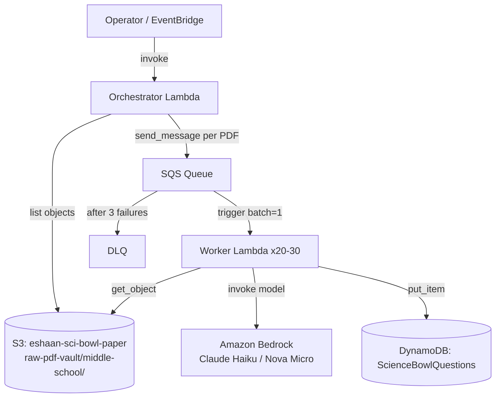

# Design Document: sci-bowl-pdf-etl

## Overview

The `sci-bowl-pdf-etl` pipeline extracts structured Science Bowl question records from ~250 PDF files stored in S3 and loads them into DynamoDB. The architecture uses two AWS Lambda functions connected by SQS: an **Orchestrator Lambda** that discovers PDFs and fans out work, and a **Worker Lambda** that processes each PDF end-to-end.

Each Worker invocation performs four sequential stages:
1. **Extract** — download the PDF from S3 and extract raw text with `pdfplumber`
2. **Chunk** — split the raw text into per-question blocks using regex on `TOSS-UP`/`BONUS` line boundaries
3. **Parse** — extract structural fields (`question_number`, `category`, `match_type`, `answer_format`) via regex; extract free-text fields (`question_stem`, `answer_choices`, `answer`) via Amazon Bedrock (Claude Haiku or Nova Micro)
4. **Write** — persist each question record to DynamoDB with overwrite semantics for idempotency

The pipeline targets ~11,500 question records across three PDF format variants (New Format, Old Format, Double Elimination Format).

---

## Architecture



**Key infrastructure parameters:**

| Resource | Parameter | Value |
|---|---|---|
| SQS Queue | Visibility timeout | 6 minutes (360 s) |
| SQS Queue | DLQ `maxReceiveCount` | 3 |
| DLQ | Message retention | 14 days |
| Worker Lambda | Reserved concurrency | 20–30 |
| DynamoDB table | PK | `Set_Round` |
| DynamoDB table | SK | `Question_Id` |
| DynamoDB GSI | PK | `Category` |
| DynamoDB GSI | SK | `MatchType` |

All AWS clients use the `onasmmon` boto3 session profile.

---

## Components and Interfaces

### Project Structure

```
sci-bowl/
  src/
    orchestrator/
      handler.py          # Orchestrator Lambda entry point
    worker/
      handler.py          # Worker Lambda entry point
      pdf_extractor.py    # pdfplumber text extraction
      chunker.py          # Regex-based question chunking
      regex_parser.py     # Structural field extraction + normalization
      llm_client.py       # Bedrock invocation + response parsing
      dynamo_writer.py    # DynamoDB put_item
  tests/
    unit/
      test_chunker.py
      test_regex_parser.py
      test_dynamo_writer.py
  requirements.txt
  template.yaml           # SAM template
```

### Orchestrator Lambda (`src/orchestrator/handler.py`)

**Entry point:** `handler(event, context)`

Responsibilities:
- Create a boto3 session with `profile_name='onasmmon'`
- Paginate `s3.list_objects_v2` over `raw-pdf-vault/middle-school/`
- Filter keys ending in `.pdf` (case-insensitive)
- Call `sqs.send_message` once per key with body `{"s3_key": "<key>"}`
- Return `{"enqueued": <count>}`
- Log errors with key/prefix context before re-raising

**Public functions:**

```python
def handler(event: dict, context: object) -> dict:
    """Lambda entry point. Returns {"enqueued": int}."""

def listPdfKeys(s3Client, bucket: str, prefix: str) -> list[str]:
    """Paginate S3 and return all .pdf keys under prefix."""

def enqueueKeys(sqsClient, queueUrl: str, keys: list[str]) -> int:
    """Send one SQS message per key. Returns count enqueued."""
```

### Worker Lambda (`src/worker/handler.py`)

**Entry point:** `handler(event, context)`

Processes one SQS record per invocation (batch size = 1). Orchestrates the four pipeline stages by calling into the sub-modules.

```python
def handler(event: dict, context: object) -> None:
    """Lambda entry point. Raises on any failure to trigger SQS retry."""

def processRecord(record: dict, s3Client, bedrockClient, dynamoClient) -> int:
    """Process one SQS record end-to-end. Returns count of items written."""
```

### PDF Extractor (`src/worker/pdf_extractor.py`)

```python
def extractText(pdfBytes: bytes) -> str:
    """Extract and concatenate text from all pages. None pages treated as ''."""

def downloadPdf(s3Client, bucket: str, key: str) -> bytes:
    """Download PDF bytes from S3."""
```

### Chunker (`src/worker/chunker.py`)

```python
def chunkQuestions(text: str) -> list[str]:
    """Split text on TOSS-UP/BONUS line boundaries. Raises ValueError if no chunks found in non-empty text."""
```

Splitting pattern: `re.split(r'(?m)^(?=TOSS-UP|BONUS)', text)` — splits before each line starting with `TOSS-UP` or `BONUS`, preserving the header in each chunk.

### Regex Parser (`src/worker/regex_parser.py`)

```python
# Constants
CANONICAL_CATEGORIES: frozenset[str] = frozenset({
    "Life Science", "Earth and Space", "Physical Science",
    "Mathematics", "Energy", "Earth Science",
    "General Science", "Math", "Chemistry",
})

def parseStructuralFields(chunk: str) -> dict[str, str]:
    """Extract question_number, category, match_type, answer_format via regex.
    Raises ValueError if any field is missing or invalid."""

def normalizeCategory(raw: str) -> str:
    """Title-case and map raw category string to canonical value.
    Raises ValueError if no canonical match found."""

def deriveSetRound(s3Key: str) -> str:
    """Derive Set_Round from S3 key segments. Raises ValueError on malformed key."""

def buildQuestionId(questionNumber: str, matchType: str) -> str:
    """Format Question_Id as Q_{n:02d}_{match_type}."""
```

**Regex patterns:**

| Field | Pattern |
|---|---|
| `question_number` | `r'^\d+'` on the header line |
| `match_type` | `r'^(TOSS-UP\|BONUS)'` on the header line |
| `answer_format` | `r'(Short Answer\|Multiple Choice)'` (case-insensitive) |
| `category` (new format) | `r'\d+\)\s+(.+?)\s+[–-]\s+(Short Answer\|Multiple Choice)'` |
| `category` (old format) | `r'\d+\)\s+([A-Z ]+)\s+(Short Answer\|Multiple Choice)'` |
| New format header | `r'MIDDLE SCHOOL - ROUND ([A-Za-z0-9 ]+)'` |
| Old format header | `r'^ROUND ([A-Za-z0-9 ]+)$'` |
| Double Elim header | `r'DOUBLE ELIMINATION ROUND ([A-Za-z0-9 ]+)'` |

### LLM Client (`src/worker/llm_client.py`)

```python
def extractFreeTextFields(
    bedrockClient,
    chunk: str,
    answerFormat: str,
) -> dict[str, str | list[str]]:
    """Invoke Bedrock to extract question_stem, answer_choices, answer.
    Raises ValueError if response is missing required fields.
    Re-raises ThrottlingException for SQS retry backoff."""

def buildPrompt(chunk: str, answerFormat: str) -> str:
    """Construct the Bedrock prompt for the given chunk and answer format."""

def parseBedrockResponse(responseBody: str) -> dict[str, str | list[str]]:
    """Parse and validate the JSON response from Bedrock."""
```

**Prompt contract:** The prompt instructs the model to return a JSON object with:
- `question_stem`: string
- `answer_choices`: list of 2–26 strings (Multiple Choice) or `[]` (Short Answer)
- `answer`: string

### DynamoDB Writer (`src/worker/dynamo_writer.py`)

```python
# Required item attributes
REQUIRED_FIELDS: tuple[str, ...] = (
    "Set_Round", "Question_Id", "Category", "MatchType",
    "question_stem", "answer_choices", "answer",
    "answer_format", "source_s3_key",
)

def writeQuestion(dynamoClient, tableName: str, item: dict) -> None:
    """Validate required fields and write item via unconditional put_item.
    Raises ValueError if any required field is missing."""
```

---

## Data Models

### DynamoDB Item Schema

| Attribute | Type | Description |
|---|---|---|
| `Set_Round` (PK) | String | e.g. `Sample-Set-13_2019-NSB-MSR-Round-10A` |
| `Question_Id` (SK) | String | e.g. `Q_01_TOSS-UP` |
| `Category` (GSI PK) | String | Canonical category name |
| `MatchType` (GSI SK) | String | `TOSS-UP` or `BONUS` |
| `answer_format` | String | `Short Answer` or `Multiple Choice` |
| `question_stem` | String | Free-text question body |
| `answer_choices` | List | Ordered strings (MC) or `[]` (SA) |
| `answer` | String | Correct answer |
| `source_s3_key` | String | Full S3 key of source PDF |

### Set_Round Derivation

Given S3 key `raw-pdf-vault/middle-school/{set-name}/{filename}.pdf`:

```
segments = key.split("/")
# segments[0] = "raw-pdf-vault"
# segments[1] = "middle-school"
# segments[2] = set-name          → Set-Name component
# segments[3] = filename.pdf      → stem = filename (no .pdf)
Set_Round = segments[2] + "_" + Path(segments[3]).stem
```

Example: `raw-pdf-vault/middle-school/Sample-Set-13/2019-NSB-MSR-Round-10A.pdf`
→ `Sample-Set-13_2019-NSB-MSR-Round-10A`

### Question_Id Format

```
Question_Id = f"Q_{int(question_number):02d}_{match_type}"
```

Example: question 1, TOSS-UP → `Q_01_TOSS-UP`

### SQS Message Body

```json
{"s3_key": "raw-pdf-vault/middle-school/Sample-Set-13/2019-NSB-MSR-Round-10A.pdf"}
```

### PDF Format Variants

| Format | Header Example | Category Line Example |
|---|---|---|
| New (Set-13+) | `MIDDLE SCHOOL - ROUND 10A` | `1) Earth and Space – Short Answer` |
| Old (Set-1~10) | `ROUND 1` | `1) LIFE SCIENCE Short Answer` |
| Double Elim | `DOUBLE ELIMINATION ROUND 1` | `1) GENERAL SCIENCE Short Answer` |

---

## Correctness Properties

*A property is a characteristic or behavior that should hold true across all valid executions of a system — essentially, a formal statement about what the system should do. Properties serve as the bridge between human-readable specifications and machine-verifiable correctness guarantees.*

### Property 1: S3 Pagination Completeness

*For any* collection of S3 keys distributed across any number of paginator pages, the `listPdfKeys` function SHALL return exactly the subset of those keys whose suffix is `.pdf` (case-insensitive), with no keys omitted and no non-pdf keys included.

**Validates: Requirements 1.1, 1.2**

---

### Property 2: Orchestrator Enqueue Count

*For any* list of N pdf keys, the `enqueueKeys` function SHALL call `send_message` exactly N times and return N, with each call's message body containing the corresponding `s3_key`.

**Validates: Requirements 1.3, 1.4**

---

### Property 3: Page Text Concatenation

*For any* list of page texts (where individual pages may be `None`, empty string, or non-empty string), `extractText` SHALL return the concatenation of all pages treated as empty string when `None`, in page order.

**Validates: Requirements 3.2**

---

### Property 4: Set_Round Derivation Round-Trip

*For any* valid S3 key of the form `raw-pdf-vault/middle-school/{set-name}/{filename}.pdf` where `set-name` and `filename` are non-empty strings, `deriveSetRound` SHALL return `{set-name}_{filename}` (filename without `.pdf` extension).

**Validates: Requirements 4.1, 4.2**

---

### Property 5: Malformed S3 Key Rejection

*For any* string that does not match the pattern `raw-pdf-vault/middle-school/{non-empty}/{non-empty}.pdf`, `deriveSetRound` SHALL raise a `ValueError`.

**Validates: Requirements 4.3**

---

### Property 6: Chunker Partitions Text Correctly

*For any* sequence of N question blocks (each starting with `TOSS-UP` or `BONUS`), concatenating them and passing the result to `chunkQuestions` SHALL return exactly N chunks whose concatenation equals the original input.

**Validates: Requirements 5.1, 5.4**

---

### Property 7: Non-Empty Input Produces At Least One Chunk

*For any* text containing at least one line starting with `TOSS-UP` or `BONUS`, `chunkQuestions` SHALL return a list of length ≥ 1.

**Validates: Requirements 5.2**

---

### Property 8: Structural Field Extraction Across All Formats

*For any* PDF chunk generated from any of the three format variants (New, Old, Double Elimination) with any valid `question_number`, `category`, `match_type`, and `answer_format`, `parseStructuralFields` SHALL return a dict containing all four fields with values matching the input.

**Validates: Requirements 6.1, 6.2, 6.3, 6.4, 9.1, 9.2, 9.3, 9.4**

---

### Property 9: Category Normalization

*For any* string that is a case-variant or whitespace-variant of a canonical category name, `normalizeCategory` SHALL return the canonical title-case form. *For any* string that does not correspond to any canonical category, `normalizeCategory` SHALL raise a `ValueError`.

**Validates: Requirements 6.5**

---

### Property 10: LLM Response Validation

*For any* Bedrock response JSON that is missing one or more of `question_stem`, `answer_choices`, or `answer` (or contains null/empty values for them), `parseBedrockResponse` SHALL raise a `ValueError`.

**Validates: Requirements 7.1, 7.7**

---

### Property 11: Multiple Choice Prompt Instruction

*For any* chunk with `answer_format = "Multiple Choice"`, `buildPrompt` SHALL produce a prompt string that instructs the LLM to return `answer_choices` as an ordered list of 2 to 26 non-empty strings.

**Validates: Requirements 7.3**

---

### Property 12: Short Answer Prompt Instruction

*For any* chunk with `answer_format = "Short Answer"`, `buildPrompt` SHALL produce a prompt string that instructs the LLM to return `answer_choices` as an empty list.

**Validates: Requirements 7.4**

---

### Property 13: DynamoDB Item Completeness

*For any* complete set of extracted fields, `writeQuestion` SHALL call `put_item` with an item containing exactly the nine required attributes (`Set_Round`, `Question_Id`, `Category`, `MatchType`, `question_stem`, `answer_choices`, `answer`, `answer_format`, `source_s3_key`) and no `ConditionExpression`.

**Validates: Requirements 8.1, 8.3, 10.4**

---

### Property 14: Question_Id Format

*For any* `question_number` in the range 1–99 and `match_type` of `TOSS-UP` or `BONUS`, `buildQuestionId` SHALL return a string of the form `Q_{n:02d}_{match_type}`.

**Validates: Requirements 8.2**

---

### Property 15: Short Answer answer_choices Written as Empty List

*For any* item where `answer_format = "Short Answer"`, `writeQuestion` SHALL pass `answer_choices = []` in the `put_item` call.

**Validates: Requirements 8.6**

---

### Property 16: Missing Required Field Prevents Write

*For any* item dict where one or more of the nine required fields is absent or `None`, `writeQuestion` SHALL raise a `ValueError` without calling `put_item`.

**Validates: Requirements 8.7**

---

## Error Handling

All errors follow a consistent pattern: **log with context → re-raise** to let SQS retry semantics handle recovery. No silent swallowing of exceptions.

### Error Taxonomy

| Stage | Error Condition | Action |
|---|---|---|
| S3 list (Orchestrator) | Paginator raises | Log prefix + error, re-raise |
| SQS send (Orchestrator) | `send_message` raises | Log s3_key + error, re-raise |
| S3 download (Worker) | `get_object` raises | Log s3_key + error, re-raise |
| PDF extraction (Worker) | pdfplumber raises | Log s3_key + error, re-raise |
| Set_Round derivation | Malformed key | Log key, raise `ValueError` |
| Chunking | Zero chunks from non-empty text | Log s3_key + warning, raise `ValueError` |
| Chunking | Whitespace-only text | Log s3_key + warning, raise `ValueError` |
| Structural parsing | Missing/invalid field | Log field name + chunk[:500], raise `ValueError` |
| Category normalization | Unknown category | Log raw value, raise `ValueError` |
| Bedrock invocation | `ThrottlingException` | Re-raise (SQS backoff handles retry) |
| Bedrock invocation | Other exception | Log s3_key + chunk index + error, re-raise |
| LLM response | Missing/empty required field | Log raw response, raise `ValueError` |
| DynamoDB write | Missing field at write time | Log field name + Set_Round + Question_Id, raise `ValueError` (no write attempted) |
| DynamoDB write | `put_item` raises | Log Set_Round + Question_Id + error, re-raise |

### Retry Behavior

SQS delivers a message up to 3 times (`maxReceiveCount=3`) before routing to the DLQ. The Worker Lambda raises on any failure, which signals SQS to redeliver. The 6-minute visibility timeout ensures a Worker invocation has time to complete before the message becomes visible again.

Idempotency is guaranteed by unconditional `put_item` (overwrite semantics): re-processing the same PDF produces the same DynamoDB items, with the last write winning.

---

## Testing Strategy

### Dual Testing Approach

Unit tests cover specific examples, edge cases, and error conditions. Property-based tests verify universal correctness properties across a wide input space. Both are required for comprehensive coverage.

### Property-Based Testing Library

**Library:** [`hypothesis`](https://hypothesis.readthedocs.io/) (Python)

Each property test runs a minimum of 100 iterations. Tests are tagged with a comment referencing the design property:

```python
# Feature: sci-bowl-pdf-etl, Property 6: Chunker Partitions Text Correctly
@given(st.lists(st.text(...), min_size=1))
def test_chunkerPartitionsTextCorrectly(questionBlocks):
    ...
```

### Unit Test Coverage

| Module | Test File | Coverage Focus |
|---|---|---|
| `chunker.py` | `test_chunker.py` | All three format variants, edge cases (single chunk, empty text, whitespace-only) |
| `regex_parser.py` | `test_regex_parser.py` | All format variants, category normalization, Set_Round derivation, malformed inputs |
| `dynamo_writer.py` | `test_dynamo_writer.py` | Complete items, missing fields, Short Answer empty list, no ConditionExpression |
| `llm_client.py` | `test_llm_client.py` | Prompt construction for MC/SA, response parsing, missing field validation |
| `pdf_extractor.py` | `test_pdf_extractor.py` | None pages, empty pages, multi-page concatenation |
| `orchestrator/handler.py` | `test_orchestrator.py` | Pagination, pdf filtering, enqueue count, error propagation |

All external dependencies (S3, SQS, DynamoDB, Bedrock, pdfplumber) are mocked in unit tests. No real AWS calls in unit tests.

### Property Test Coverage

| Property | Test | Hypothesis Strategy |
|---|---|---|
| 1: S3 Pagination Completeness | `test_listPdfKeysReturnsAllPdfKeys` | `st.lists(st.text())` for keys, random page splits |
| 2: Orchestrator Enqueue Count | `test_enqueueKeysCallsOncePerKey` | `st.lists(st.from_regex(r'[\w/]+\.pdf'))` |
| 3: Page Text Concatenation | `test_extractTextConcatenatesPages` | `st.lists(st.one_of(st.none(), st.text()))` |
| 4: Set_Round Derivation | `test_deriveSetRoundRoundTrip` | `st.from_regex(r'[A-Za-z0-9-]+')` for set-name and filename |
| 5: Malformed Key Rejection | `test_deriveSetRoundRejectsInvalidKeys` | `st.text()` filtered to not match valid pattern |
| 6: Chunker Partitions Text | `test_chunkerPartitionsTextCorrectly` | `st.lists(st.text(), min_size=1)` for question blocks |
| 7: Non-Empty Produces Chunk | `test_chunkQuestionsProducesAtLeastOne` | `st.text()` with at least one TOSS-UP/BONUS line |
| 8: Structural Field Extraction | `test_parseStructuralFieldsAllFormats` | `st.sampled_from(FORMAT_VARIANTS)` × random field values |
| 9: Category Normalization | `test_normalizeCategoryCanonicalVariants` | `st.sampled_from(CANONICAL_CATEGORIES)` with random casing |
| 10: LLM Response Validation | `test_parseBedrockResponseRejectsIncomplete` | `st.fixed_dictionaries` with random missing fields |
| 11: MC Prompt Instruction | `test_buildPromptMcContainsListInstruction` | Random MC chunk text |
| 12: SA Prompt Instruction | `test_buildPromptSaContainsEmptyListInstruction` | Random SA chunk text |
| 13: DynamoDB Item Completeness | `test_writeQuestionCallsPutItemCorrectly` | `st.fixed_dictionaries` with all required fields |
| 14: Question_Id Format | `test_buildQuestionIdFormat` | `st.integers(1, 99)` × `st.sampled_from(["TOSS-UP", "BONUS"])` |
| 15: SA answer_choices Empty List | `test_writeQuestionSaAnswerChoicesEmpty` | Random SA items |
| 16: Missing Field Prevents Write | `test_writeQuestionRaisesOnMissingField` | `st.fixed_dictionaries` with one field set to None |

### Integration Tests

Integration tests (not run in CI by default) verify end-to-end behavior against real AWS resources using the `onasmmon` profile:

- Orchestrator discovers and enqueues PDFs from the real S3 bucket
- Worker processes a single known PDF and writes to DynamoDB
- DLQ receives a message after 3 Worker failures

### Test Dependencies (pinned)

```
hypothesis==6.112.2
pytest==8.3.3
pytest-mock==3.14.0
moto==5.0.16
```
